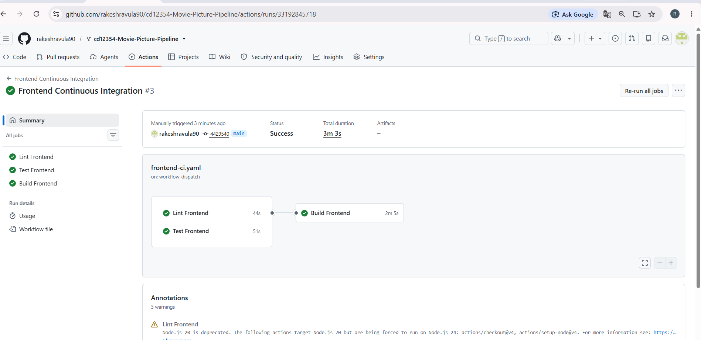

# 🎬 Movie Picture Pipeline

> **Udacity CD12354 — Movie Picture Pipeline**
>
> A complete CI/CD implementation using **GitHub Actions, Docker, Amazon ECR, Amazon EKS, and Kubernetes**.

---

# 📋 Table of Contents

- [Project Overview](#-project-overview)
- [Architecture](#-architecture)
- [Technology Stack](#-technology-stack)
- [Repository Structure](#-repository-structure)
- [Frontend Continuous Integration](#-frontend-continuous-integration)
- [Backend Continuous Integration](#-backend-continuous-integration)
- [Frontend Continuous Deployment](#-frontend-continuous-deployment)
- [Backend Continuous Deployment](#-backend-continuous-deployment)
- [Git SHA Image Tagging](#-git-sha-image-tagging)
- [Kubernetes Deployment](#-kubernetes-deployment)
- [Application Verification](#-application-verification)
- [Deployed Application](#-deployed-application)
- [CI/CD Flow](#-cicd-flow)
- [Deployment Verification Commands](#-deployment-verification-commands)
- [Project Evidence](#-project-evidence)
- [Final Status](#-final-status)
- [Conclusion](#-conclusion)
- [Udacity Copyright and License](#-udacity-copyright-and-license)

---

# 📌 Project Overview

The **Movie Picture Pipeline** project implements an end-to-end Continuous Integration and Continuous Deployment pipeline for a movie application.

The application consists of:

- **Frontend** — React application
- **Backend** — Flask API
- **Docker** — Containerization
- **Amazon ECR** — Docker image registry
- **Amazon EKS** — Kubernetes cluster
- **Kubernetes** — Application orchestration
- **AWS LoadBalancer** — Public access to the deployed services
- **GitHub Actions** — Continuous Integration and Continuous Deployment

The final application was successfully deployed to Amazon EKS and verified through the public frontend and backend endpoints.

---

# 🏗️ Architecture

```text
                         GitHub Repository
                                |
                                v
                       +------------------+
                       |  GitHub Actions  |
                       +------------------+
                          /            \
                         /              \
                        v                v
                 Frontend CI        Backend CI
                    |                    |
                 Lint/Test            Lint/Test
                    |                    |
                    v                    v
                Docker Build        Docker Build
                    |                    |
                    v                    v
                Frontend ECR         Backend ECR
                    |                    |
                    v                    v
                Frontend EKS         Backend EKS
                    |                    |
                    +---------+----------+
                              |
                              v
                       Kubernetes Services
                              |
                              v
                       Movie Application
```

---

# 🛠️ Technology Stack

| Technology | Purpose |
|---|---|
| GitHub | Source code repository |
| GitHub Actions | CI/CD automation |
| React | Frontend application |
| Flask | Backend API |
| Python 3.10 | Backend runtime |
| Node.js | Frontend runtime/build |
| Docker | Application containerization |
| Amazon ECR | Container image registry |
| Amazon EKS | Kubernetes cluster |
| Kubernetes | Container orchestration |
| AWS LoadBalancer | Public service access |

---

# 📁 Repository Structure

```text
cd12354-Movie-Picture-Pipeline/
│
├── .github/
│   └── workflows/
│       ├── frontend-ci.yaml
│       ├── frontend-cd.yaml
│       ├── backend-ci.yaml
│       └── backend-cd.yaml
│
├── setup/
│
├── starter/
│   ├── frontend/
│   │   ├── Dockerfile
│   │   ├── package.json
│   │   ├── package-lock.json
│   │   └── k8s/
│   │       ├── deployment.yaml
│   │       └── service.yaml
│   │
│   └── backend/
│       ├── Dockerfile
│       ├── Pipfile
│       ├── Pipfile.lock
│       ├── app.py
│       └── k8s/
│           ├── deployment.yaml
│           ├── service.yaml
│           └── kustomization.yaml
│── screenshots/
│       ├── frontend-ci-workflow.png
│       ├── backend-ci-workflow.png
│       ├── frontend-cd-workflow.png
│       ├── backend-cd-workflow.png
│       ├── frontend-sha-deployment.png
│       ├── backend-sha-deployment.png
│       ├── frontend-output.png
│       ├── frontend-moviedetails-output.png
│       ├── backend-api-working-output.png
│       ├── kubectl-get-pods-output.png
│       ├── kubectl-get-services-output.png
│       └── kubectl-get-all-output.png
│
└── README.md
```

---

# 🔄 Frontend Continuous Integration

## Workflow

The frontend CI workflow validates the frontend application before deployment.

### Steps

1. Checkout the source code
2. Set up Node.js
3. Install frontend dependencies
4. Run linting
5. Run frontend tests
6. Build the frontend Docker image

### Workflow File

```text
.github/workflows/frontend-ci.yaml
```

### Successful Frontend CI

All frontend CI jobs completed successfully:

- ✅ Lint Frontend
- ✅ Test Frontend
- ✅ Build Frontend



---

# 🔄 Backend Continuous Integration

## Workflow

The backend CI workflow validates the Flask backend before deployment.

### Steps

1. Checkout the source code
2. Set up Python 3.10
3. Install Pipenv
4. Install dependencies
5. Run Flake8
6. Run Pytest
7. Build the backend Docker image

### Workflow File

```text
.github/workflows/backend-ci.yaml
```

### Successful Backend CI

All backend CI jobs completed successfully:

- ✅ Lint Backend
- ✅ Test Backend
- ✅ Build Backend


---

# 🚀 Frontend Continuous Deployment

## Workflow

The frontend CD workflow automates the deployment of the React application.

### Deployment Steps

1. Checkout source code
2. Lint frontend
3. Test frontend
4. Configure AWS credentials
5. Authenticate with Amazon ECR
6. Build the Docker image
7. Tag the image using the Git commit SHA
8. Push the image to Amazon ECR
9. Configure access to Amazon EKS
10. Update the Kubernetes deployment with the SHA-tagged image
11. Wait for the Kubernetes rollout to complete

### Workflow File

```text
.github/workflows/frontend-cd.yaml
```

### Successful Frontend CD

- ✅ Lint Frontend
- ✅ Test Frontend
- ✅ Build and Push Frontend
- ✅ Deploy Frontend


---

# 🚀 Backend Continuous Deployment

## Workflow

The backend CD workflow automates deployment of the Flask API to Amazon EKS.

### Deployment Steps

1. Checkout source code
2. Lint backend
3. Test backend
4. Configure AWS credentials
5. Authenticate with Amazon ECR
6. Build the backend Docker image
7. Tag the image using the Git commit SHA
8. Push the SHA-tagged image to Amazon ECR
9. Configure access to Amazon EKS
10. Update the Kubernetes backend deployment
11. Wait for the Kubernetes rollout to complete

### Workflow File

```text
.github/workflows/backend-cd.yaml
```

### Successful Backend CD

- ✅ Lint Backend
- ✅ Test Backend
- ✅ Build and Push Backend
- ✅ Deploy Backend


---

# 🏷️ Git SHA Image Tagging

The deployment uses a **Git commit SHA** as the Docker image tag instead of relying on `latest`.

This provides traceability between:

```text
Git commit
    ↓
Docker image
    ↓
Amazon ECR
    ↓
Amazon EKS deployment
```

This means the exact image produced from a specific commit can be identified and deployed.

---

## Frontend Git SHA Deployment

The deployed frontend image was verified as:

```text
527877549745.dkr.ecr.us-east-1.amazonaws.com/movie-frontend:43f2ebc737e3e18cd02e9dffa6a22aeb5ce89ab4
```

The Kubernetes deployment was verified directly using:

```bash
kubectl get deployment frontend \
  -o jsonpath='{.spec.template.spec.containers[0].image}'
```


---

## Backend Git SHA Deployment

The deployed backend image was verified as:

```text
527877549745.dkr.ecr.us-east-1.amazonaws.com/movie-backend:35001b7f79d0500eb4d843456aba0c39d3f576d5
```

The Kubernetes deployment was verified directly using:

```bash
kubectl get deployment backend \
  -o jsonpath='{.spec.template.spec.containers[0].image}'
```


---

# ☸️ Kubernetes Deployment

The application was deployed to an Amazon EKS cluster.

The Kubernetes environment contains:

- Frontend Deployment
- Backend Deployment
- Frontend LoadBalancer Service
- Backend LoadBalancer Service
- Running frontend pod
- Running backend pod

---

## Running Pods

Both application pods were verified as running successfully.


---

## Kubernetes Services

The frontend and backend services were verified as `LoadBalancer` services.


---

## Kubernetes Resources

The complete Kubernetes resources were verified using:

```bash
kubectl get all
```


---

# 🧪 Application Verification

## 🎬 Frontend — Movie List

The deployed frontend successfully displays the movie list:

- Top Gun: Maverick
- Sonic the Hedgehog
- A Quiet Place


---

## 🎥 Frontend — Movie Details

The deployed frontend successfully displays movie details.


---

## 🔌 Backend API

The backend `/movies` endpoint was successfully verified and returned movie data.


---

# 🌐 Deployed Application

## Frontend

The frontend was successfully exposed through an AWS Elastic Load Balancer.

**Frontend URL:**

```text
http://k8s-default-frontend-918120c914-a2f93d65e24c7386.elb.us-east-1.amazonaws.com
```

## Backend API

The backend API was successfully exposed through an AWS Elastic Load Balancer.

**Movies API URL:**

```text
http://k8s-default-backend-e5c4895f7d-6af84ea1ebdab90b.elb.us-east-1.amazonaws.com/movies
```

> **Note:** AWS LoadBalancer endpoints can change if the Kubernetes infrastructure is recreated.

---

# 🔁 CI/CD Flow

## Frontend Pipeline

```text
Git Push
   |
   v
Frontend CI
   |
   +--> Lint
   |
   +--> Test
   |
   +--> Docker Build
   |
   v
Frontend CD
   |
   +--> Build Docker Image
   |
   +--> Tag with Git SHA
   |
   +--> Push to Amazon ECR
   |
   +--> Deploy SHA Image to Amazon EKS
   |
   v
Frontend LoadBalancer
```

---

## Backend Pipeline

```text
Git Push
   |
   v
Backend CI
   |
   +--> Lint
   |
   +--> Test
   |
   +--> Docker Build
   |
   v
Backend CD
   |
   +--> Build Docker Image
   |
   +--> Tag with Git SHA
   |
   +--> Push to Amazon ECR
   |
   +--> Deploy SHA Image to Amazon EKS
   |
   v
Backend LoadBalancer
```

---

# 🔍 Deployment Verification Commands

The following commands were used to verify the Kubernetes deployment.

## Check Pods

```bash
kubectl get pods
```

## Check Services

```bash
kubectl get services
```

## Check All Kubernetes Resources

```bash
kubectl get all
```

## Verify Frontend Image

```bash
kubectl get deployment frontend \
  -o jsonpath='{.spec.template.spec.containers[0].image}'
```

## Verify Backend Image

```bash
kubectl get deployment backend \
  -o jsonpath='{.spec.template.spec.containers[0].image}'
```

The final image verification confirmed that both frontend and backend deployments were running **SHA-tagged ECR images** rather than `latest`.

---

# 📸 Project Evidence

The `docs/screenshots/` directory contains supporting evidence for the completed project.

| Evidence | Screenshot |
|---|---|
| Frontend CI | [Frontend CI](docs/screenshots/frontend-ci-workflow.png) |
| Backend CI | [Backend CI](docs/screenshots/backend-ci-workflow.png) |
| Frontend CD | [Frontend CD](docs/screenshots/frontend-cd-workflow.png) |
| Backend CD | [Backend CD](docs/screenshots/backend-cd-workflow.png) |
| Frontend Git SHA | [Frontend SHA](docs/screenshots/frontend-sha-deployment.png) |
| Backend Git SHA | [Backend SHA](docs/screenshots/backend-sha-deployment.png) |
| Kubernetes Pods | [Pods](docs/screenshots/kubectl-get-pods-output.png) |
| Kubernetes Services | [Services](docs/screenshots/kubectl-get-services-output.png) |
| Kubernetes Resources | [All Resources](docs/screenshots/kubectl-get-all-output.png) |
| Frontend Movie List | [Movie List](docs/screenshots/frontend-output.png) |
| Movie Details | [Movie Details](docs/screenshots/frontend-moviedetails-output.png) |
| Backend API | [Backend API](docs/screenshots/backend-api-working-output.png) |

---

# 🏆 Final Status

| Component | Status |
|---|:---:|
| Frontend CI | ✅ |
| Backend CI | ✅ |
| Frontend CD | ✅ |
| Backend CD | ✅ |
| Frontend Docker Image | ✅ |
| Backend Docker Image | ✅ |
| Frontend ECR Image | ✅ |
| Backend ECR Image | ✅ |
| Frontend Git SHA Deployment | ✅ |
| Backend Git SHA Deployment | ✅ |
| Frontend EKS Pod | ✅ |
| Backend EKS Pod | ✅ |
| Frontend LoadBalancer | ✅ |
| Backend LoadBalancer | ✅ |
| Movie List | ✅ |
| Movie Details | ✅ |
| Backend `/movies` API | ✅ |

---

# ✅ Conclusion

The **Movie Picture Pipeline** project successfully implements an end-to-end CI/CD solution.

The project includes:

- Automated frontend linting and testing
- Automated backend linting and testing
- Docker image creation
- Amazon ECR image publishing
- Git SHA-based Docker image tagging
- Amazon EKS deployment
- Kubernetes LoadBalancer services
- Successful frontend application verification
- Successful backend API verification
- Direct verification that EKS is running SHA-tagged images

The final application was successfully deployed and tested on Amazon EKS.

---

# 📜 Udacity Copyright and License

Copyright © 2012 - 2020, Udacity, Inc.

Udacity hereby grants you a license in and to the Educational Content, including but not limited to homework assignments, programming assignments, code samples, and other educational materials and tools (as further described in the Udacity Terms of Use), subject to, as modified herein, the terms and conditions of the Creative Commons Attribution-NonCommercial-NoDerivs 3.0 License located at http://creativecommons.org/licenses/by-nc-nd/4.0 and successor locations for such license (the "CC License") provided that, in each case, the Educational Content is specifically marked as being subject to the CC License.

Udacity expressly defines the following as falling outside the definition of "non-commercial": (a) the sale or rental of (i) any part of the Educational Content, (ii) any derivative works based at least in part on the Educational Content, or (iii) any collective work that includes any part of the Educational Content; (b) the sale of access or a link to any part of the Educational Content without first obtaining informed consent from the buyer (that the buyer is aware that the Educational Content, or such part thereof, is available at the Website free of charge); (c) providing training, support, or editorial services that use or reference the Educational Content in exchange for a fee; (d) the sale of advertisements, sponsorships, or promotions placed on the Educational Content, or any part thereof, or the sale of advertisements, sponsorships, or promotions on any website or blog containing any part of the Educational Material, including without limitation any "pop-up advertisements"; (e) the use of Educational Content by a college, university, school, or other educational institution for instruction where tuition is charged; and (f) the use of Educational Content by a for-profit corporation or non-profit entity for internal professional development or training.

THE SERVICES AND ONLINE COURSES (INCLUDING ANY CONTENT) ARE PROVIDED "AS IS" AND "AS AVAILABLE" WITH NO REPRESENTATIONS OR WARRANTIES OF ANY KIND, EITHER EXPRESSED OR IMPLIED, INCLUDING, BUT NOT LIMITED TO, THE IMPLIED WARRANTIES OF MERCHANTABILITY, FITNESS FOR A PARTICULAR PURPOSE, AND NON-INFRINGEMENT. YOU ASSUME TOTAL RESPONSIBILITY AND THE ENTIRE RISK FOR YOUR USE OF THE SERVICES, ONLINE COURSES, AND CONTENT. WITHOUT LIMITING THE FOREGOING, WE DO NOT WARRANT THAT (A) THE SERVICES, WEBSITES, CONTENT, OR THE ONLINE COURSES WILL MEET YOUR REQUIREMENTS OR EXPECTATIONS OR ACHIEVE THE INTENDED PURPOSES, (B) THE WEBSITES OR THE ONLINE COURSES WILL NOT EXPERIENCE OUTAGES OR OTHERWISE BE UNINTERRUPTED, TIMELY, SECURE OR ERROR-FREE, (C) THE INFORMATION OR CONTENT OBTAINED THROUGH THE SERVICES, SUCH AS CHAT ROOM SERVICES, WILL BE ACCURATE, COMPLETE, CURRENT, ERROR-FREE, COMPLETELY SECURE OR RELIABLE, OR (D) THAT DEFECTS IN OR ON THE SERVICES OR CONTENT WILL BE CORRECTED. YOU ASSUME ALL RISK OF PERSONAL INJURY, INCLUDING DEATH AND DAMAGE TO PERSONAL PROPERTY.
